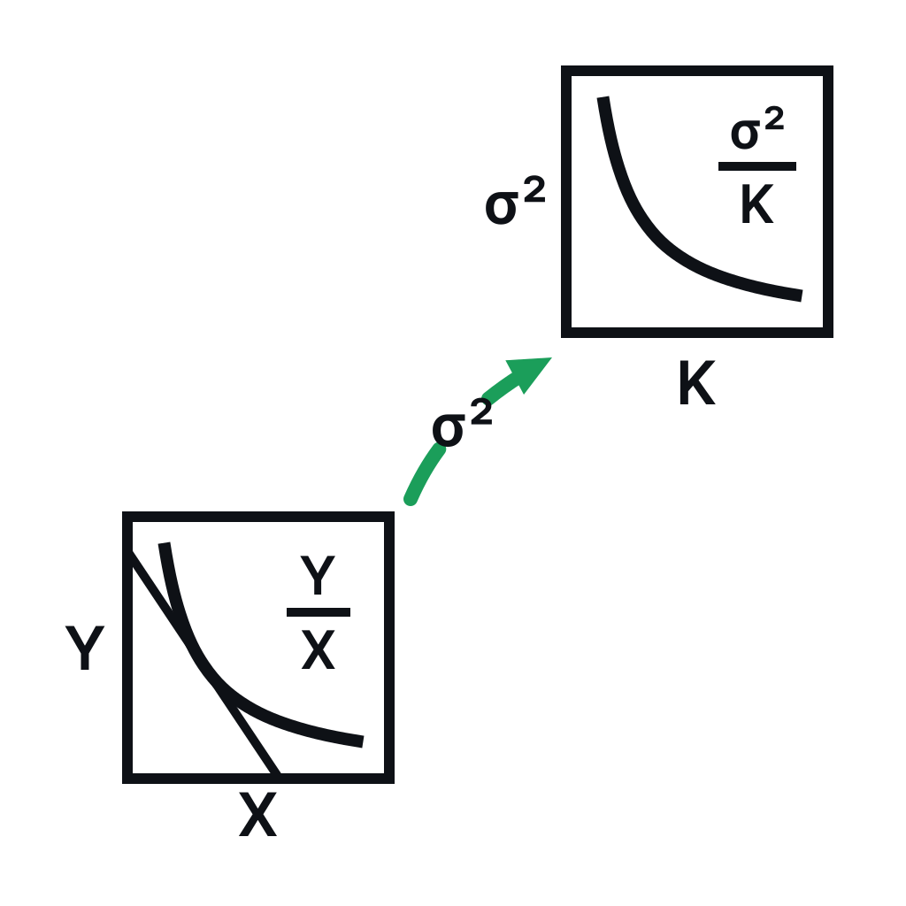

# cfmm-vol-markets

<p align="center">
  <picture>
    <source media="(prefers-color-scheme: dark)" srcset="assets/logo/png/mark-full-dark-1024.png">
    <source media="(prefers-color-scheme: light)" srcset="assets/logo/png/mark-full-light-1024.png">
    
  </picture>
</p>

The **on-chain protocol core** for typed volatility markets — the Plank/Solidity
contracts, their Foundry test surface, and the type kernel that binds them. Renamed
from `cfmm-replicationPlank`.

## Repository split

This repo is one member of a multi-repo ecosystem. The **`d2p-finance`** GitHub org owns
the canonical/upstream repos; the **`JMSBPP/*`** repos are the develop forks.

| Concern | Repo | Mounted here as |
|---|---|---|
| On-chain protocol core (this repo) | `d2p-finance/cfmm-vol-markets` | — |
| Lean/math + protocol spec | `d2p-finance/cfmm-vol-markets-spec` | `spec/` (submodule) |
| Off-chain RPC / rig | `d2p-finance/gams-evm-transport` | `offchain/` (submodule) |
| Research shelf (extracted paper text + manifest + topic cards — **not** PDFs) | `d2p-finance/cfmm-refs` | `refs/` (submodule) |
| GAMS numerical model | `d2p-finance/cfmm-numopt` | — |

## Contributing / workflow

**All changes are made on the `JMSBPP/*` forks and reach the `d2p-finance/*` canonical
repos ONLY through pull requests (fork → upstream).** Never commit or push directly to a
`d2p-finance` canonical repo — push to the `JMSBPP` fork and open a PR to canonical.

`develop` on the fork is branch-protected: the sole required check is the `develop-gate`
(`.github/workflows/develop-gate.yml`), which runs a human environment approval, then the
Foundry (`forge`) and Plank (`plank`) build/test jobs on a self-hosted runner.

## Layout

```
src/              Plank (custom EVM language) + Solidity protocol sources (*.plk, *.sol)
test/             Foundry unit/integration tests (*.t.sol)
foundry-scripts/  Foundry scripts (forge script)
lib/              git-submodule dependencies (forge-std, panoptic-v2-core, bunni-v2,
                  plankified-univ3, plank-monorepo, v3-core, plank-foundry-deployer, …)
spec/ offchain/ refs/   canonical-repo submodules (see the split table above)
notes/            binding spec docs (DATA_CONTRACT.md, UNITS_AND_SCALES.md)
.planning/        GSD planning tree
```

## Build & test

The build is **Foundry + the Plank toolchain** (there is no Hardhat step).

```bash
just show uhi10
```

The `refs/`, `offchain/`, and `spec/` submodules are not initialized by the build or CI —
init them explicitly (`git submodule update --init <path>`) only when you need their content.

## License

See `LICENSE`.
